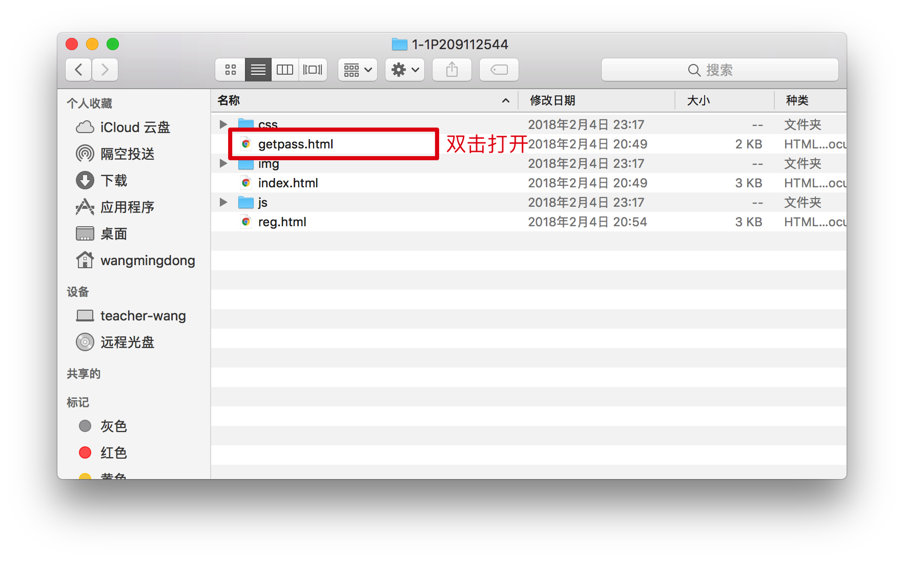
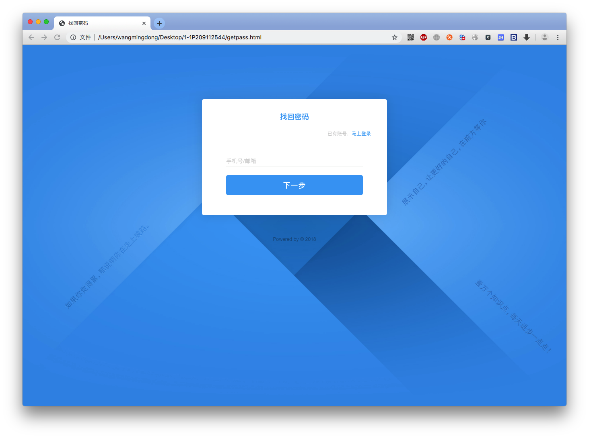
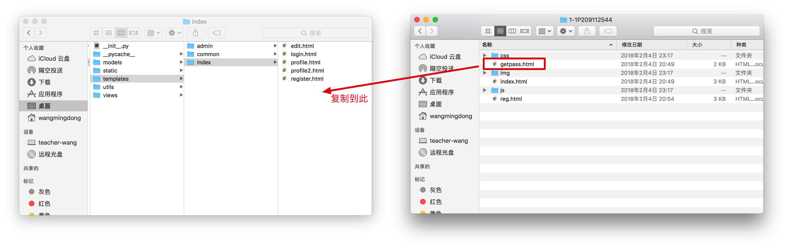
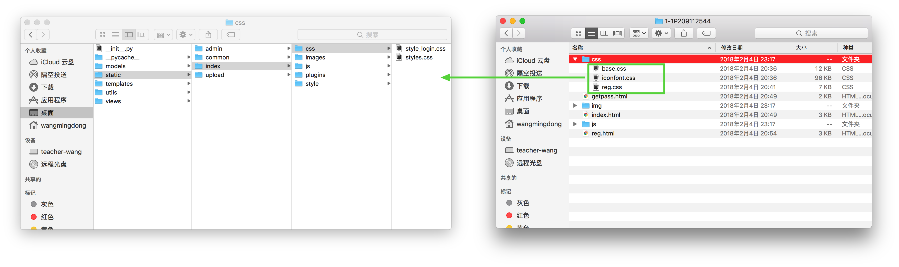
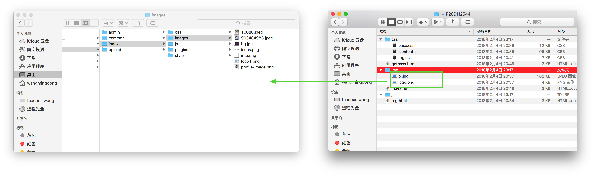
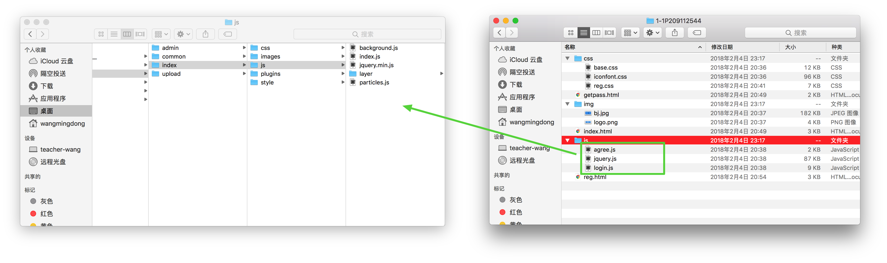

# 通过邮箱找回密码

## 1. 目的

今天的是互联网的时代，意味着很多用户在很多不同的网站上有各种各样的账户，因为网站的密码长度不同，导致用户有很多密码需要记忆

因此导致用户忘记密码的可能性大大增加

怎样才能让用户顺利的找回密码，就是本节课程主要的内容

## 2. 分析

1. 点击"忘记密码"
2. 输入之前的账户邮箱，此时网站会自动向指定的邮箱发送带有密码找回的URL的邮件
3. 我们点击邮件中的URL，打开一个新的页面
4. 在新的页面中输入新密码，从而完成密码找回功能

## 3. 实现

### 下载模板

### 将html以及静态资源文件放入到项目路径

在`app/views/index/veiws.py`中添加视图函数`getpassword`

